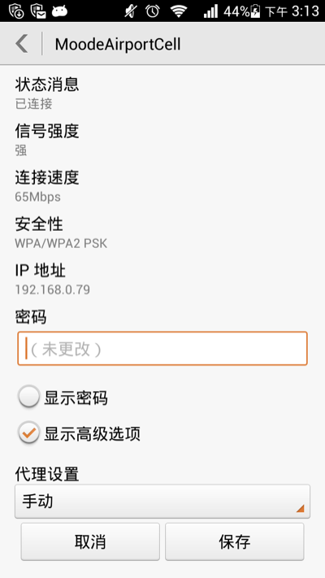

mobile-proxy
============

## Why
因为本地开发测试不方便。。

## 依赖

* [nginx](http://nginx.org/cn/) 与 [squid](http://www.squid-cache.org/) 二选一，推荐使用squid，因为 nginx不支持https正向代理
* `brew install nginx`
* `brew install squid`

## nginx

### 配置

在nginx.conf `/usr/local/etc/nginx/nginx.conf` 中的http块中添加一行
```
include path/to/your/mobile-proxy/etc/nginx/mobile-proxy.conf;
```

### 启动

```bash
sudo nginx
```
### 关闭

```bash
sudo nginx -s stop
```

## squid

### 配置
在squid.conf `/usr/local/opt/squid/etc/squid.conf` 结尾中添加一行
```
include path/to/your/mobile-proxy/etc/squid/mobile-proxy.conf
```

### 启动

```bash
squid
```

### 关闭
```bash
squid -k kill
```

## 手机端配置

* 选择设置>WLAN     


* 修改当前wifi网络连接, 在代理设置中选择手动,     
代理服务器主机名填写你开发用的机器ip,    
代理服务器端口填写 `8099`(nginx) 或 `3128`(squid)     



* 点击保存即可完成配置


