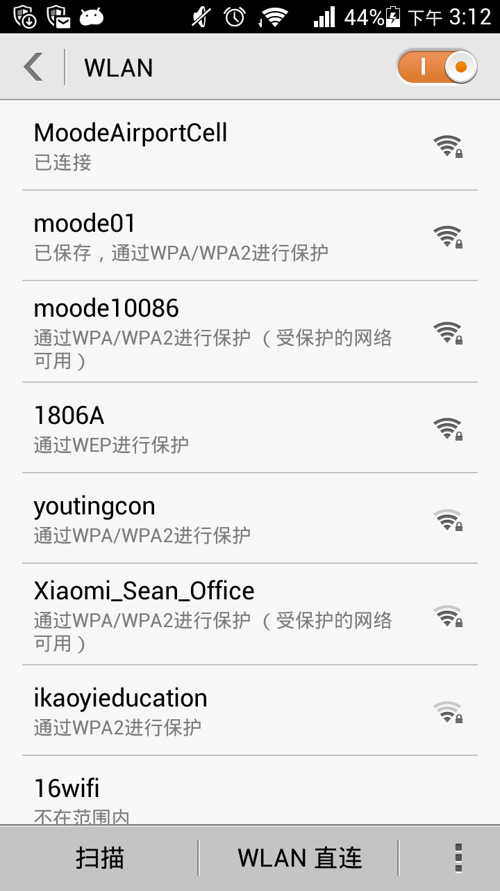
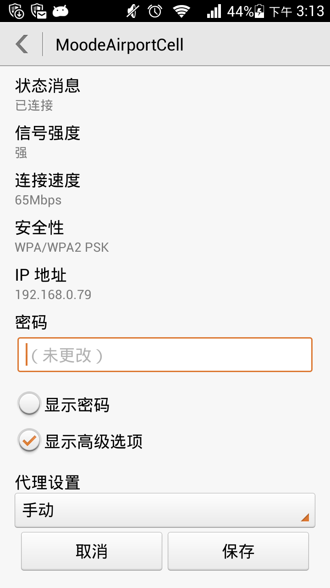
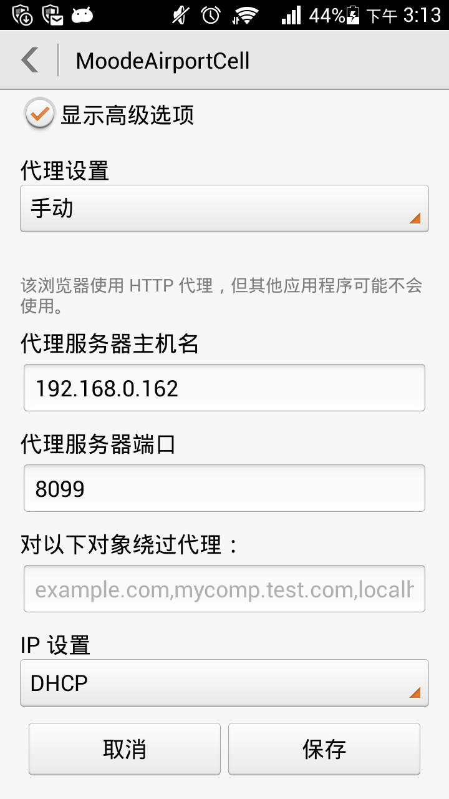

mobile-proxy
============

## 依赖

* nginx

## 安装

在nginx.conf中的http块中添加一行
```
include path/to/your/mobile-proxy/etc/nginx/mobile-proxy.conf
```

## 启动

```bash
sudo nginx
```

## 手机端配置

1. 选择设置>WLAN


2. 修改当前wifi网络连接, 在代理设置中选择手动,代理服务器主机名填写你开发用的机器ip,代理服务器端口填写 `8099`



3. 点击保存即可完成配置